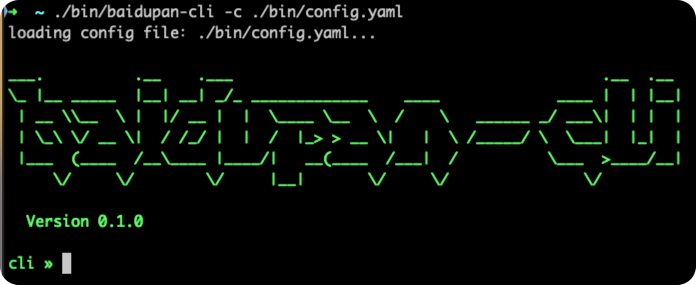
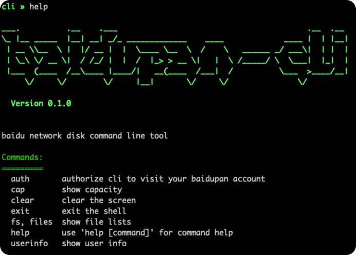
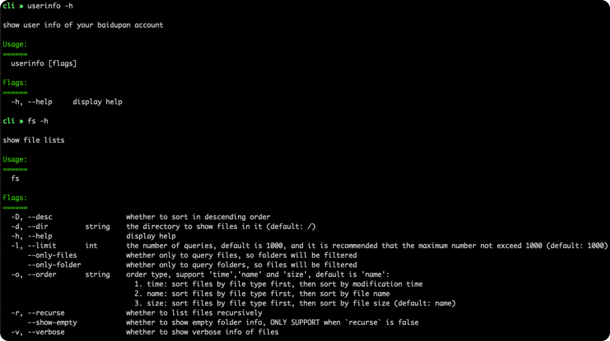

> **NOTE:**
>
> 由于百度官方已经禁止个人账号创建应用，无法获取开发所需的appkey等信息，该项目暂停开发。

# baidupan-cli

百度网盘命令行工具。

## 功能列表

* [x] 扫码登录授权
* [x] 获取用户信息
* [x] 获取网盘容量
* [x] 查询目录下的文件列表，支持递归、排序、筛选文件或目录
* [ ] 搜索文件
* [ ] 查询文件元数据信息
* [ ] 查询特定文件类型列表
* [ ] 统计文件数量
* [ ] 查询分类文件列表
* [x] 文件/文件夹重命名操作
* [x] 目录下正则批量重命名
* [ ] 文件复制、移动、删除操作
* [ ] 上传文件
* [ ] 下载文件
* [ ] 创建文件夹
* [ ] 文件分享服务
* [ ] ……

## 使用说明

### 授权

首先需要通过授权获取网盘的访问权限。

* 启动 `cli`:

```shell
./baidupan-cli -c config.yaml
```

通过 `-c` 指定配置文件，如果不指定默认寻找同目录下的名为 `config.yaml`:



* 键入如下命令获取授权二维码:

```shell
auth
```

如图所示：


* 扫码授权

通过移动设备扫描二维码并授予 `cli` 访问百度盘的权限，不久会看到授权成功信息, 之后即可正常使用！

### 查看帮助

启动 `cli` 后键入 `help` 可以查阅帮助信息:



想要查看具体某个命令的帮助，键入 `COMMAND -h`：



### 查询用户信息

* 命令:

```shell
userinfo [OPTIONS]
```

* 选项

无

### 查询磁盘容量

* 命令

```shell
cap [OPTIONS]
```

* 选项

  * `-e`: 是否检查过期信息，设置此参数结果会展示7天内是否有容量到期(结果的 `Expire In 7 Days` 显示 `Y`)
  * `-f`: 是否检查免费磁盘空间信息，设置后结果的 `Free` 属性为免费磁盘大小
  * `-H`: 是否输出为友好可读性信息

### 查询目录下的文件列表

* 命令

```shell
files [OPTIONS]
```

* 选项
  * `-d, --dir`: 查询的目录绝对路径，默认为根路径 `/`
  * `-o, --order`: 设置排序类型，支持 `name` 按照名称排序（默认），`size` 按照文件大小排序，`time` 按照修改时间排序
  * `-D, --desc`: 排序时是否降序排列，默认为升序排列
  * `-l, --limit`: 设置查询的文件最大数量，默认为1000，建议不超过 1000
  * `--only-files`: 是否仅在结果中显示文件，即不显示文件夹，默认文件和目录都显示
  * `--only-folder`: 是否仅在结果中显示目录，即不显示文件，默认文件和目录都显示
  * `-r, --rescure`: 是否递归查询目录下的所有文件，默认为否
  * `--show-empty`: 是否显示空文件夹信息，仅 `--rescure` 设置为是后有效
  * `-v, --verbose`: 是否显示详细信息，默认仅显示文件名
  * `-H, --human-readable`: 是否输出为友好可读性信息
  * `-g, --show-form`: 是否将结果输出为表单格式，默认输出为表格

### 重命名文件/目录

* 命令

```shell
rename [OPTIONS]
```

* 选项
  * `-p, --path`: 需要重命名的文件/目录绝对路径（必填）
  * `-n, --newname`: 新名称（仅 base name，不允许包含 `/`，必填）
  * `--async`: 是否以异步任务方式提交（默认否）
  * `--ondup`: 重名冲突策略（可选，原样透传给 openapi）

### 批量重命名（正则）

* 命令（别名：`rb`）

```shell
rename-batch [OPTIONS]
```

* 示例 1（默认 sed 替换模式：直接给 `FIND TO` 两个参数）

将 `UML设计图` 中的 `设计` 替换为 `分析`，得到 `UML分析图`（只预览）：

```shell
rb --dir "/05-我的文档" --target dirs 设计 分析
```

真正执行：

```shell
rb --dir "/05-我的文档" --target dirs 设计 分析 --apply
```

如需把 `FIND` 当作正则（而非纯文本），加 `--find-regex`（此时等价于 `--find`）。

* 示例 2（正则模式：目录 `/video` 下，把 `xxx.mp4` 重命名为 `xxx_1080p.mp4`，先预览）

```shell
rename-batch --dir /video --pattern '^(.*)\.mp4$' --replace '${1}_1080p.mp4'
```

* 真正执行（加上 `--apply` 即可执行）

```shell
rename-batch --dir /video --pattern '^(.*)\.mp4$' --replace '${1}_1080p.mp4' --apply
```

* 示例 3（正则模式：目录 `/xxx` 下，把 `xxx【xxx】xxx` 重命名为 `xxxxxx`， 去掉 `【】` 中的内容）
```shell
rb --dir "/xxx" --target dirs --pattern '^(.*)【.*】(.*)$' --replace '${1}${2}' --apply
```

* 选项（核心）
  * `-d, --dir`: 扫描目录（默认 `/`）
  * `-r, --recurse`: 是否递归扫描
  * `--target`: 重命名目标：`files`（默认）/`dirs`/`all`
  * `--pattern`: 正则匹配文件/目录名（正则模式）
  * `--replace`: 替换字符串（支持 `$1..$n`）（正则模式）
  * `FIND TO`: 默认模式的两个位置参数（sed 替换模式）
  * `--find, --to`: sed 模式的同义参数（更适合脚本/显式）
  * `--find-regex`: 把 `FIND/--find` 按正则处理（默认否）
  * `--apply`: 执行（默认只预览）
  * `--progress`: 执行时显示进度/转圈提示（默认是）
  * `--continue-on-error`: 执行出错时跳过当前 chunk，继续处理剩余（默认否）
  * `--ignore-errors`: 配合 `--continue-on-error` 使用，即使有失败也返回成功退出码
